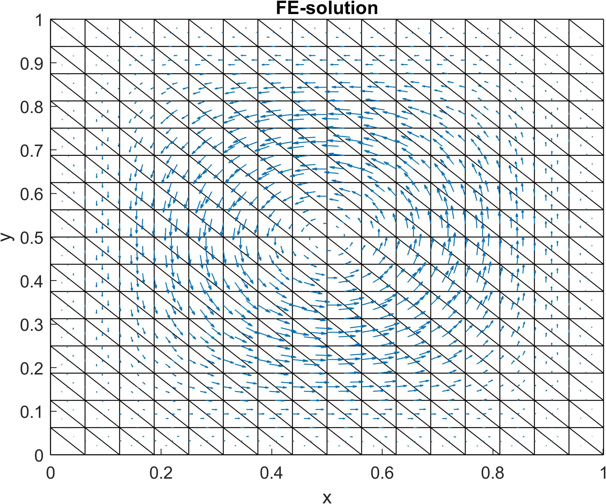

# Weak Galerkin Finite Element Method for Stokes problem

>This repo contains `MATLAB` implementation for Weak Galerkin FEM solver that can be used to solve the steady-state Stokes problem in 2D. The solver was implemented as a project for course *MS-E1653 Finite Element Method* in Aalto University, but it did not work initially. After a lot of debugging with the help of professors Antti Hannukainen (Aalto University Math) and Lin Mu (University of Georgia Math), the solver finally started working. So, thanks for both of them for their help!

## The problem description

Steady-state Stokes problem in 2D is as follows
```math
\begin{align*}
    -\Delta \mathbf{u} + \nabla p &= \mathbf{f},\quad \mathrm{in\ } \Omega\\
    \nabla \cdot \mathbf{u} &= 0,\quad \mathrm{in\ } \Omega\\
    \mathbf{u} &= \mathbf{g},\quad \mathrm{in\ } \partial\Omega\,
\end{align*}
```
where $\mathbf{u}$ is the velocity field, $p$ is the pressure field, $\mathbf{g}$ defines the Dirichlet type boundary condition (usually constant) and $\mathbf{f}$ is the load function. The weak formulation for the above problem with $\mathbf{g}=0$ is
```math
\begin{align*}
    (\nabla \mathbf{u}, \nabla\mathbf{v}) - (\nabla \cdot \mathbf{v}, p) &= (\mathbf{f}, \mathbf{v}),\quad \mathbf{v} \in [H^1_0(\Omega)]^2\\
    (\nabla \cdot \mathbf{u}, q) &= 0,\quad q \in L^2_0(\Omega)\,.
\end{align*}
```
As we use Weak Galerkin finite element method, we use weak gradient operator $\nabla_w$ and a discontinuous FE-space with piecewise constant basis functions. Thus the FE-spaces for velocity and pressure are
```math
\begin{align*}
    V_h &= \{ \mathbf{v} = \{\mathbf{v_0}, \mathbf{v_b}\}:\ \mathbf{v_0}|_T \in [P_0(T)]^2,\ \mathbf{v_b}|_e \in [P_0(T)]^2,\ e \subset \partial T,\ T \in \tau_h \} \\
	W_h &= \{ q \in L^2_0(\Omega): \ q|_T \in P_0(T),\ T \in \tau_h \}\,,
\end{align*}
```
where $T$ denotes triangle element, $e$ is an edge and $\mathbf{v_0}$ is defined in $T_0 = T\setminus \partial T$ and $\mathbf{v_b}$ is defined on $\partial T$.


## Implementation

The mesh generation part of the solver is based on the 2D FEM solver implementation that was given on the course.[1] The unmodified version of that solver can be found from the [MyCourses page](https://mycourses.aalto.fi/course/view.php?id=36259&section=4). The Weak Galerkin method with piecewise constant basis functions and their assembly was adopted from paper *"A SIMPLE FINITE ELEMENT METHOD FOR THE STOKES EQUATIONS"* written by Lin Mu and Xiu Ye in 2017.[2] The paper `.pdf` is also found on this repo from file `AMS_Stokes_Simple.pdf`.


## Results

The performance of the solver was tested against example 1 in paper [2], which had following solution for $\mathbf{u}$ and $p$
```math
\begin{align*}
    \mathbf{u} &= 
    \begin{bmatrix}
        2\pi\sin(\pi x) \sin(\pi x) \sin(\pi y) \cos(\pi y)\\
      -2\pi \sin(\pi x)\sin(\pi y) \sin(\pi y)\cos(\pi x)
    \end{bmatrix}\\
    p &= \cos(\pi x)\cos(\pi y)\,.
\end{align*}
```
The load function $\mathbf{f}$ corresponding to these is
```math
\mathbf{f} = 
\begin{bmatrix}
	-4\pi^3 \sin( \pi y) \cos(\pi y)(\cos^2 (\pi x) - \sin^2 (\pi x)) - \pi\cos(\pi y)\sin(\pi x)\\
	4\pi^3 \sin(\pi x) \cos(\pi x)(\cos^2 (\pi y)- \sin^2 (\pi y)) - \pi\cos(\pi x)\sin(\pi y)
\end{bmatrix}\,,
```
and the imposed boundary condition is $\mathbf{u} = 0,\ \mathrm{on}\ \partial\Omega$.

The figure below shows the FE-solution for a problem with the load given above:



The analytic solution is plotted below and we can see that the solutions match each other very well, at least visually.


Lastly, the we tested the performance against the computational fluid dynamics stanrad problem, e.g. lid-driven cavity ($\mathbf{f}=0,\ \mathbf{u}(x,1)=1, \mathbf{u}(0,y)=\mathbf{u}(1,y)=\mathbf{u}(x,0)=0$). The resulting velocity magnitude field is shown below:


## References

[1] Hannukainen A., "*Finite element assembly for 2D meshes (util.zip)*", MS-E1653 Finite Element Method course, Aalto University, 2023

[2] Mu, L., Ye, X. *“A simple finite element method for the Stokes equations”*, Advances in Computational Mathematics, 43, 1305–1324, 2017, [https://doi.org/10.1007/s10444-017-9526-z](https://doi.org/10.1007/s10444-017-9526-z).